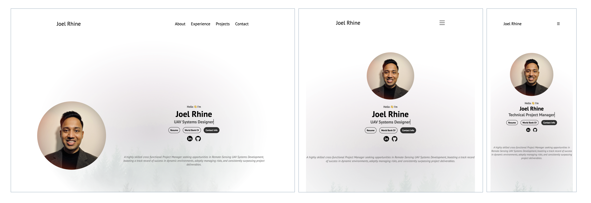

<!-- PROJECT SHIELDS -->
[![Contributors][contributors-shield]][contributors-url]
[![Forks][forks-shield]][forks-url]
[![Stargazers][stars-shield]][stars-url]
[![Issues][issues-shield]][issues-url]
[![MIT License][license-shield]][license-url]
[![LinkedIn][linkedin-shield]][linkedin-url]

 

  
  <h3 align = "center"> Responsive Professional Website</h3>
  

    
  

 

<!-- TABLE OF CONTENTS -->

  
Table of Contents

  <ol>
    <li><a href="#built-with">Built With</a></li>
    <li><a href="#contributors">Contributors</a></li>
    <li><a href="#license">License</a></li>
    <li><a href="#contact">Contact</a></li>
    <li><a href="#acknowledgments">Acknowledgments</a></li>
  </ol>

## Built With
Responsive website built using HTML, CSS and JS, understanding fundamentals of web development. Deployed on Hostinger. 

* [![HTML][HTML]][HTML-url]
* [![CSS][CSS]][CSS-url]
* [![JavaScript][JavaScript]][JavaScript-url]

(<a href="#readme-top">back to top</a>)

## Contributors:

(<a href="#readme-top">back to top</a>)

<!-- LICENSE -->
## License

Distributed under the MIT License. See `LICENSE.txt` for more information.

(<a href="#readme-top">back to top</a>)

<!-- CONTACT -->
## Contact

Joel Rhine: [Email](mailto:joelrhine7@gmail.com)
Website Link: [Joel Rhine | Home](https://joelrhine.tech)

(<a href="#readme-top">back to top</a>)

<!-- ACKNOWLEDGMENTS -->
## Acknowledgments

* [Responsive Portfolio Website From Scratch](https://www.youtube.com/watch?v=ldwlOzRvYOU)
* [Lokesh Dhakar - Lightbox](https://lokeshdhakar.com/projects/lightbox2/)
* [Best README Template](https://github.com/othneildrew/Best-README-Template)
* [Img Shields](https://shields.io)

(<a href="#readme-top">back to top</a>)

    

<!-- MARKDOWN LINKS & IMAGES -->
<!-- https://www.markdownguide.org/basic-syntax/#reference-style-links -->
[contributors-shield]: https://img.shields.io/github/contributors/rhinejoel/portfolio.svg?style=for-the-badge
[contributors-url]: https://github.com/rhinejoel/portfolio/graphs/contributors
[forks-shield]: https://img.shields.io/github/forks/rhinejoel/portfolio.svg?style=for-the-badge
[forks-url]: https://github.com/rhinejoel/portfolio/network/members
[stars-shield]: https://img.shields.io/github/stars/rhinejoel/portfolio.svg?style=for-the-badge
[stars-url]: https://github.com/rhinejoel/portfolio/stargazers
[issues-shield]: https://img.shields.io/github/issues/rhinejoel/portfolio.svg?style=for-the-badge
[issues-url]: https://github.com/rhinejoel/portfolio/issues
[license-shield]: https://img.shields.io/github/license/rhinejoel/portfolio.svg?style=for-the-badge
[license-url]: https://github.com/othneildrew/Best-README-Template/blob/master/LICENSE.txt
[linkedin-shield]: https://img.shields.io/badge/-LinkedIn-black.svg?style=for-the-badge&logo=linkedin&colorB=555
[linkedin-url]: https://linkedin.com/in/joel-rhine

[HTML]: https://img.shields.io/badge/html5-DE6952?style=for-the-badge&logo=html5&logoColor=white
[HTML-url]: https://developer.mozilla.org/en-US/docs/Web/HTML
[CSS]: https://img.shields.io/badge/css3-4E6CF5?style=for-the-badge&logo=css3&logoColor=4FC08D
[CSS-url]: https://developer.mozilla.org/en-US/docs/Web/CSS
[JavaScript]: https://img.shields.io/badge/JavaScript-000000?style=for-the-badge&logo=javascript&logoColor=61DAFB
[JavaScript-url]: https://developer.mozilla.org/en-US/docs/Web/JavaScript
